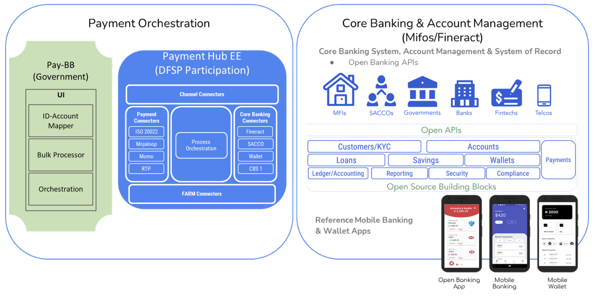
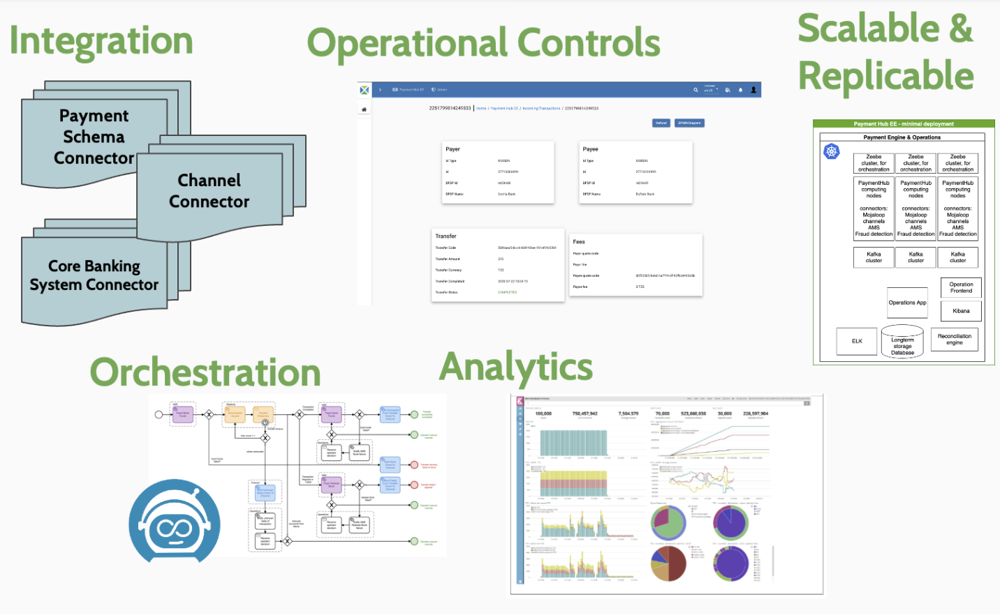

# Payment Hub EE

Payment Hub Enterprise Edition middleware and Payments Orchestration Engine for integration to real-time payment systems.
Orchestrate & Streamline bulk G2P & P2G payements. Enable seamless participation of DFSPs into payments.

Payment Hub EE supports both DFSP and Government Functions (v1.13.0 awarded GovStack Level 1 Compliance) [ GovStack PH EE Compliance Statement](https://testing.govstack.global/requirements/details/Payment%20Hub%20Enterprise%20Edition%20(PH-EE)).

- Connectorised approach allowing for easy payment rail and systems integration.
- BPMN Workflows supported.
- 2 Workflow Engines supported Zeebe or Netflix Conductor (DPG core)

The solution is a multi repo approach supporting modularity.

---

## Repository Structure for Modularity

Version 2.0 renames the repositories to `paymenthub-ee-*` and reduces their number by combining
several of the old ones into a single repository, while keeping them as separate modules. Where a
repository has not been migrated yet it is listed under its `ph-ee-*` name and marked.

### Core / Orchestration

[paymenthub-ee-core](https://github.com/openMF/paymenthub-ee-core) – The shared foundation: the platform BOM and the common library every Java component builds on (combines `ph-ee-connector-common` and the BOM). This repo.  
[ph-ee-dpg-core](https://github.com/openMF/ph-ee-dpg-core) – DPG-compliant orchestration engine built on Netflix Conductor (alternative to the Zeebe-based flow). _Not migrated yet._  
[ph-ee-dpg-template](https://github.com/openMF/ph-ee-dpg-template) – Starter template for building components on the Conductor/DPG-core architecture. _Not migrated yet._  
[paymenthub-ee-data-pipeline](https://github.com/openMF/paymenthub-ee-data-pipeline) – Everything that moves workflow data out of the Zeebe broker and into a queryable store (combines `ph-ee-exporter`, `ph-ee-importer-es`, `ph-ee-importer-rdbms` and `ph-ee-zeebe-ops`).  
[paymenthub-ee-k8s-operators](https://github.com/openMF/paymenthub-ee-k8s-operators) – Kubernetes Operators for deploying/managing PH-EE components.  

### Connectors (integration to payment rails, core banking, AMS)

[paymenthub-ee-connector-channel](https://github.com/openMF/paymenthub-ee-connector-channel) – Front-door connector that receives requests from client channels.  
[paymenthub-ee-connector-bulk](https://github.com/openMF/paymenthub-ee-connector-bulk) – Closed-loop bulk payment connector.  
[paymenthub-ee-connector-mojaloop](https://github.com/openMF/paymenthub-ee-connector-mojaloop) – Connector to the Mojaloop Switch scheme.  
[paymenthub-ee-connector-mm-gsma](https://github.com/openMF/paymenthub-ee-connector-mm-gsma) – Connector for the GSMA Mobile Money API.  
[ph-ee-connector-gsma-mm-dpg](https://github.com/openMF/ph-ee-connector-gsma-mm-dpg) – DPGA-compliant variant of the GSMA MM connector using Netflix Conductor workflow. _Not migrated yet._  
[paymenthub-ee-connector-mpesa](https://github.com/openMF/paymenthub-ee-connector-mpesa) – Connector for Safaricom M-Pesa.  
[ph-ee-connector-mccbs](https://github.com/openMF/ph-ee-connector-mccbs) – Connector to Mastercard Cross-Border Services (currently demo/non-production). _Not migrated yet._  
[paymenthub-ee-connector-slcb](https://github.com/openMF/paymenthub-ee-connector-slcb) – Connector integrating with SLCB.  
[ph-ee-connector-pch-java](https://github.com/openMF/ph-ee-connector-pch-java) – Connector for a Payment Clearing House integration (gRPC based). _Not migrated yet._  
[paymenthub-ee-connector-crm](https://github.com/openMF/paymenthub-ee-connector-crm) – CRM-facing connector microservice.  
[paymenthub-ee-connector-ams-mifosx](https://github.com/openMF/paymenthub-ee-connector-ams-mifosx) – Account Management System (AMS) connector for MifosX core banking.  
[ph-ee-connector-ams-pesa](https://github.com/openMF/ph-ee-connector-ams-pesa) – AMS connector for a Pesa-type core banking system. _Not migrated yet._  
[paymenthub-ee-connector-ams-paygops](https://github.com/openMF/paymenthub-ee-connector-ams-paygops) – AMS connector for the PayGOps platform.  

### Operations, UI & Monitoring

[paymenthub-ee-bff](https://github.com/openMF/paymenthub-ee-bff) – Backend for the Operations web app: monitoring and managing transactions and workflows, plus the G2P programs API (combines `ph-ee-operations-app` and `ph-ee-operations-g2p-service`).  
[paymenthub-ee-operationsui-angular](https://github.com/openMF/paymenthub-ee-operationsui-angular) – Front-end for the Operations web app (original in Angular).  
[paymenthub-ee-operationsui-react](https://github.com/openMF/paymenthub-ee-operationsui-react) – React-based front-end for Operations (modernized replacement in React ShadCN).  

### Identity & Account Mapping

[paymenthub-ee-account-mapper](https://github.com/openMF/paymenthub-ee-account-mapper) – Maps external identities to account details for payment routing, with the account validator implementations as a module (combines `ph-ee-identity-account-mapper` and `ph-ee-id-account-validator-impl`).  
[paymenthub-ee-auth](https://github.com/openMF/paymenthub-ee-auth) – Identity/auth provider service for PH-EE (was `ph-ee-identity-provider`).  

### Supporting services

[paymenthub-ee-notifications](https://github.com/openMF/paymenthub-ee-notifications) – Notification delivery, works with the separate message-gateway project.  
[paymenthub-ee-vouchers](https://github.com/openMF/paymenthub-ee-vouchers) – Voucher management/issuance system.  
[paymenthub-ee-p2g](https://github.com/openMF/paymenthub-ee-p2g) – Bill payment processing microservice, P2G (was `ph-ee-bill-pay`).  
[paymenthub-ee-bulk-processor](https://github.com/openMF/paymenthub-ee-bulk-processor) – Bulk/batch transaction processing microservice (G2P).  
[ph-ee-nats-importer-rdbms](https://github.com/openMF/ph-ee-nats-importer-rdbms) – Consumes NATS events and writes business data to an off-site RDBMS. _Not migrated yet._  
[ph-ee-acknowledgement](https://github.com/openMF/ph-ee-acknowledgement) – Placeholder repo for an acknowledgement service (README only, no code yet). _Not migrated yet._  

### Testing & QA

[paymenthub-ee-e2e-tests](https://github.com/openMF/paymenthub-ee-e2e-tests) – The end-to-end suite and the mock payment scheme it transacts against (combines `ph-ee-integration-test` and `ph-ee-connector-mock-payment-schema`).  
[ph-ee-testing-toolkit](https://github.com/openMF/ph-ee-testing-toolkit) – Functional testing toolkit for PH-EE development/QA. _Not migrated yet._  
[ph-ee-testing-toolkit-ui](https://github.com/openMF/ph-ee-testing-toolkit-ui) – Experimental UI for the testing toolkit. _Not migrated yet._  
[ph-ee-ai-arch-test](https://github.com/openMF/ph-ee-ai-arch-test) – Experimental AI-driven architecture testing. _Not migrated yet._  

### Environment / Deployment

[ph-ee-env-template](https://github.com/openMF/ph-ee-env-template) – Template environment/deployment configs. _Not migrated yet._  
[ph-ee-env-labs](https://github.com/openMF/ph-ee-env-labs) – Actual lab environment configs — BPMN flows and Helm charts for a live lab deployment. _Not migrated yet._  

---

> For detailed documentation check the documentation: [PH EE Gitbook](https://app.gitbook.com/@mifos/s/docs/payment-hub-ee/overview)

---

# paymenthub-ee-core

The shared foundation for Payment Hub EE: the platform Bill of Materials (BOM) and the common library that every PH-EE Java component builds on.

## What it does

This repo publishes two artifacts that the rest of Payment Hub EE depends on. It is not a runnable service. It has no `main` method and starts no server. It only produces libraries that other PH-EE components import.

- The **BOM** (`org.mifos:paymenthub-ee-bom`) pins one agreed version for each dependency: Spring Boot, Apache Camel, Zeebe, Jackson, AWS SDK, and more. Each component imports it with `enforcedPlatform`, so every component lines up on the same versions and does not pin them by hand.
- The **core library** (`org.mifos:paymenthub-ee-core`) is the shared code, the migrated `ph-ee-connector-common`. It holds shared DTOs, channel and Mojaloop model classes, Zeebe helpers, and small utilities that the connectors reuse.

## Modules

- `bom` — the Payment Hub EE Bill of Materials; pins the versions of Spring Boot, Camel, Zeebe, Jackson, and the other shared dependencies.
- `core` — the shared common library (the migrated `ph-ee-connector-common`): shared DTOs, channel and Mojaloop model classes, Zeebe helpers, and utilities.
- `bom:bom-verification` — a small module that imports the BOM and resolves every declared dependency, so the build fails here if the BOM does not resolve correctly.

## How it fits into Payment Hub EE

Every PH-EE Java connector depends on this repo twice: on the BOM for its dependency versions, and on core for the shared code it reuses. That makes `paymenthub-ee-core` the base of the PH-EE dependency graph. When its versions or shared classes change, all the connectors pick up the change from here.

## Tech stack

Java 21, Spring Boot 3.4, Apache Camel 4, Jakarta EE 10, built with a Gradle multi-module setup. It publishes `org.mifos:paymenthub-ee-bom` and `org.mifos:paymenthub-ee-core`.

## Branches

- `dev` is the active development branch — all PRs should target `dev`.
- `main` holds released versions.

## Contributing

See [contributing.md](contributing.md), our [Code of Conduct](CODE_OF_CONDUCT.md) and the [security policy](security.md).

For more developer specifics regarding Payment Hub EE please also refer to:

- [Community Code of Conduct](CODE_OF_CONDUCT.md)
- [PH EE Contributing Guidelines](contributing.md)
- [Security Disclosure Policy](security.md)
- [Contributor Licence Agreement](https://mifos.org/about-us/financial-legal/mifos-contributor-agreement/)

More information about Mifos and our Mission can be found at [mifos.org](https://mifos.org)
